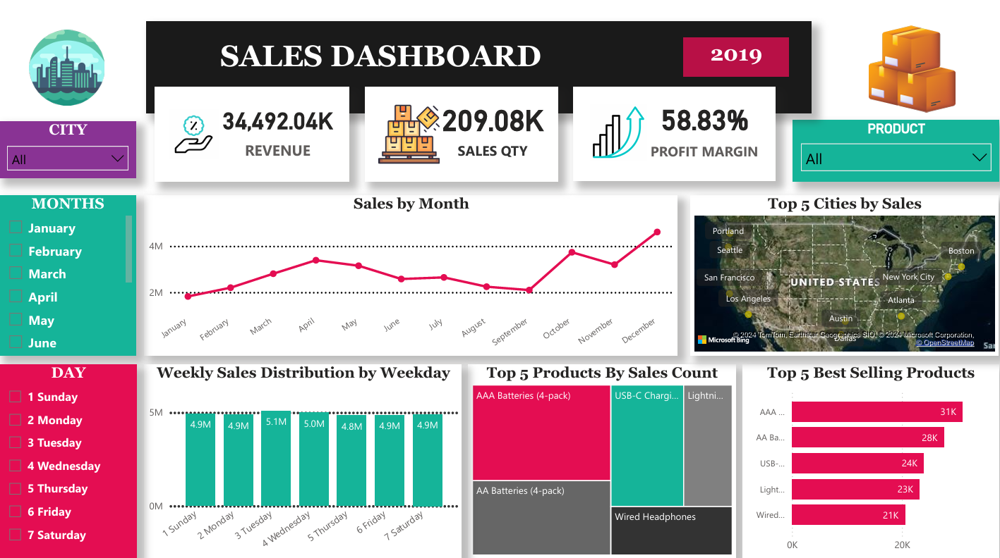

# Sales Analysis with PowerBI

## Table of Contents
1. [Project Overview](#project-overview)
2. [Technologies Used](#technologies-used)
3. [Repository Structure](#repository-structure)
4. [Dashboard](#dashboard)
5. [Analysis Objective](#analysis-objective)
6. [Acknowledgments](#acknowledgments)
7. [Conclusion](#conclusion)
8. [Contacts](#contacts)

# Project Overview
This project aims to analyze sales data to identify trends, best-selling products, and revenue metrics. Insights will guide business decisions by highlighting profitability, seasonal sales patterns, and peak sales days to optimize strategies and improve overall performance.

# Technologies Used
- **Power BI**: Used for data visualization and dashboard creation.
- **GitHub**: Hosting the raw HR data.
- **Excel**: Import Excel data into Power BI using the "Get Data" option.

# Repository Structure
```bash
Sales-Analysis-Power-BI:.
│
├── README.md
│
├── Datasets
│   └── Sales Data.csv
│
├── Preview
│   └── Sales_Analysis.pdf
│   └── Sales_Analysis.png

```
# Dashboard
Here is the Sales Dashboard created in Power BI:



# Analysis Objective
1. **Sales Trends Over Time**:
    - **Daily and Monthly Patterns**: Track and visualize changes in sales performance over different time periods. Look for seasonal trends, peak sales periods, and downturns.
    - **Growth or Decline**: Identify whether sales are increasing, decreasing, or remaining stable over time.

2. **Best-Selling Products**:
    - **Top Products by Revenue**: Determine which products contribute most significantly to overall sales.
    - **Frequency of Purchases**: Analyze the number of units sold and how often these products are purchased.

3. **Revenue Metrics**:
    - **Total Sales**: Calculate the aggregate sales revenue over a given period.
    - **Profit Margins**: Use the formula Profit Margin=((Total Sales−Total Cost)/ Total Sales)×100% to assess the profitability of sales. Evaluate margins by product and overall to determine cost-effectiveness and pricing strategies.

4. **Top Insights**:
    - **Top-Selling Products**: Identify which products are consistently top performers and analyze their impact on revenue.
    - **High-Performance Cities**: Pinpoint the cities with the highest frequency of sales and determine geographic areas driving business growth.
    - **Sales Trend Analysis**: Visualize and interpret sales trends across different days, months, or seasons to inform inventory and marketing strategies.

# Acknowledgments
A special thanks to the open-source communities behind `Ms Excel` and `Power BI` for providing such powerful tools for handling and visualising data.

# Conclusion
By extracting valuable insights, you can drive informed business decisions and understand how sales trends evolve both seasonally and monthly. Identifying best-selling products helps pinpoint the most popular and revenue-generating items, while assessing revenue metrics evaluates overall financial performance, including total sales, profit margins, and cost efficiency. This comprehensive approach enables businesses to make data-driven choices, optimise product offerings, and improve financial outcomes effectively.

# Contacts
For any questions or further information, feel free to contact me :)
- **linkedin**: <a href="https://www.linkedin.com/in/dhruvsoni22/" target="_blank">Dhruv Soni</a><br>
- **Email**: dhruvsoni240@gmail.com


	


